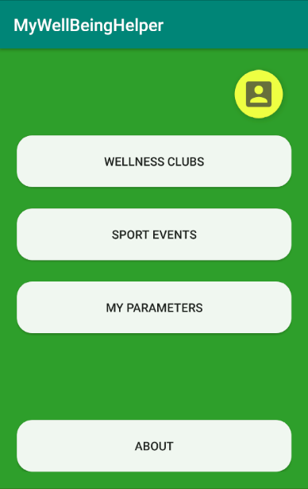
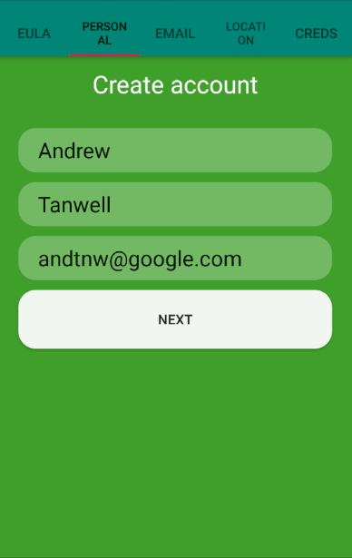
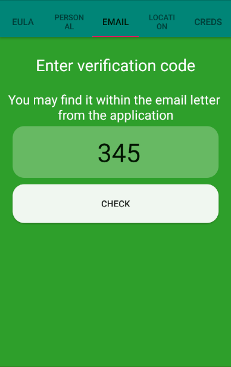
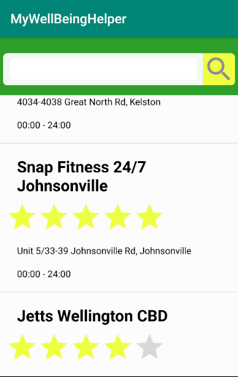
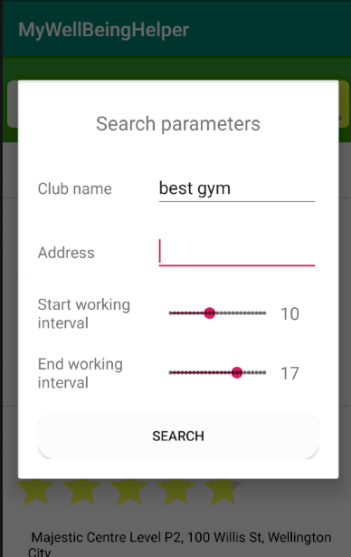
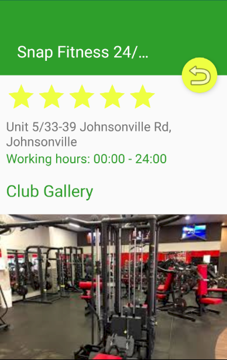
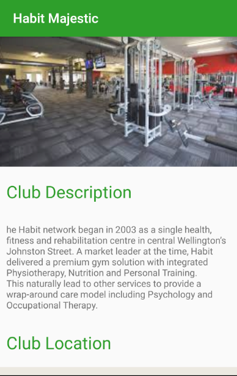
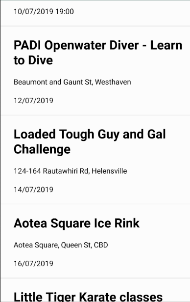
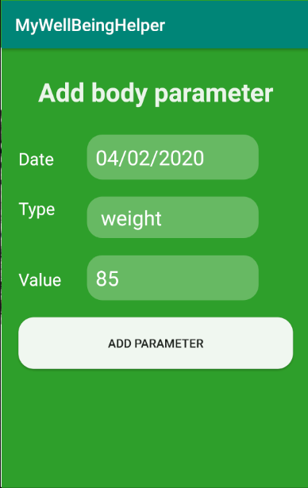
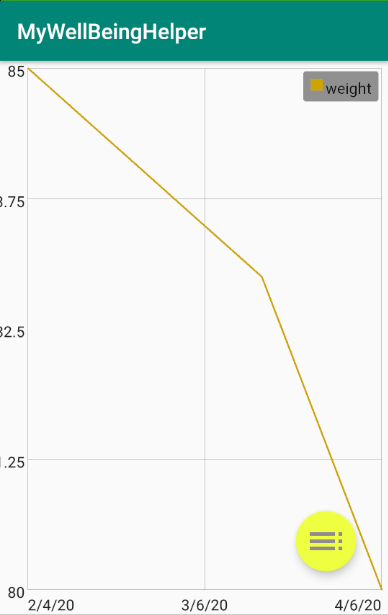

# MyWellBeingHelper

The application uses offline SQLite database to store information about sport clubs and events.

This application is a personal helper in the development of user's own healthy lifestyle.\
Providing information about activity évents and wellness centers, it helps to increase the body energy of a user. The user can also log personal body self-care parameters to assess his progress such as blood pressure, number of daily steps, heart rate, glucose level, and weight.

The application uses an offline data to store information about sports clubs and events.

## Platform
Android MinSDK 28 (Android Lollipop v5.1)

## Language
Java

## Database 
SQLite3

## Screenshots

### Main Screen
 

### Acount creation screens

### Sport clubs list

### Sport club details screen

### Events list

### Event details

### Add body params screen

### View body params graph

